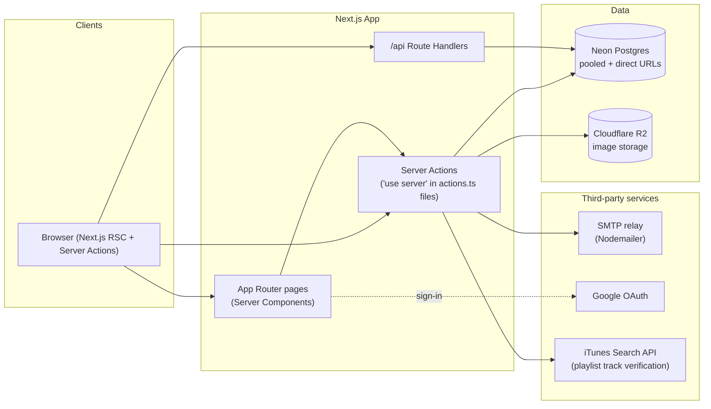

# Runners League — Technical Architecture

**Audience:** incoming backend engineer. **Purpose:** get you from zero to a correct mental model of the system — stack, data model, auth, integrations, and the spots that need care — without reading every file first.

---

## 1. What this is

Runners League is a social app for runners chasing the **World Marathon Majors** (Tokyo, Boston, London, Berlin, Chicago, New York, Sydney, and — from 2027 — Cape Town). Runners log races and training runs, track a gear locker, see community-wide rankings and gear popularity, and share a crowd-voted running playlist. There's an admin-reviewed verification flow for race results. All activity/race entry is manual — there is no wearable-device or third-party fitness-platform sync (Strava and an Apple HealthKit companion app previously existed here and were removed; see the git history around "drop wearable integrations" if you need the old implementation for reference).

## 2. Stack at a glance

| Layer | Choice | Notes |
|---|---|---|
| Framework | **Next.js 16.3.1**, App Router | React 19.2.8. See [§4](#4-frontend--nextjs-specifics) — this version has real breaking changes vs. older Next.js knowledge. |
| Language | TypeScript `^5` | |
| Styling | **Tailwind CSS v4** | CSS-first config, no `tailwind.config.js` |
| ORM | **Prisma 7.9.1** | New `prisma-client` generator (not `prisma-client-js`) + `@prisma/adapter-pg` driver adapter — this is a different setup than most Prisma docs/tutorials assume |
| Database | **PostgreSQL** via **Neon** | Pooled connection for app runtime, direct connection for migrations |
| Auth | **Auth.js v5** (`next-auth@5.0.0-beta.32`, still beta) | Google OAuth + email magic link, database sessions |
| Email | **Nodemailer** (raw SMTP) | No Resend/SendGrid/Postmark — bring your own SMTP relay |
| File storage | **Cloudflare R2**, via `@aws-sdk/client-s3` (S3-compatible API) | Not real AWS S3 |
| Testing | **None** | No Jest/Vitest/Playwright configured. `npm run lint` (ESLint 9) is the only automated gate, and there's no CI running it. |
| Hosting | Not explicit in-repo, but every signal (`trustHost: true`, Neon, no Dockerfile/CI) points to **Vercel** | |

## 3. System architecture



**Server Actions are the dominant mutation pattern** — most writes happen through `"use server"` functions colocated as `src/app/**/actions.ts`, called directly from client components via `<form action={...}>` or `startTransition`. The `/api` surface (`src/app/api/`) is reserved for things that structurally can't be a Server Action: the Auth.js catch-all handler, and a handful of public read-only JSON GET endpoints (`/api/gear`, `/api/activities`, `/api/races`, `/api/playlist`).

There is **no `middleware.ts` / `proxy.ts`** in this app. Auth and admin checks are done at the top of each page/Server Action individually (see [§8](#8-auth--session-management)), not at a routing layer. Anything new you add that needs auth needs its own check — nothing is gated globally.

## 4. Frontend — Next.js specifics

This app pins **Next.js 16**, which changed enough from earlier versions that pretrained knowledge about Next.js can actively mislead you. The repo's `AGENTS.md` (auto-regenerated by `next dev`, safe to commit) points at `node_modules/next/dist/docs/` for the current docs — read `01-app/02-guides/upgrading/version-16.md` first if anything about routing/caching looks unfamiliar. The highlights that matter here:

- **`middleware.ts` is deprecated in favor of `proxy.ts`** (and there's neither file in this repo — see §3).
- **Async Request APIs are fully enforced**: `cookies()`, `headers()`, `params`, `searchParams` must all be `await`ed. You'll see this throughout, e.g. `src/app/(main)/profile/[username]/page.tsx`.
- **Turbopack** is the default bundler for both `next dev` and `next build`.
- Caching: this app does **not** opt into the new Cache Components model (no `cacheComponents` flag in `next.config.ts`). It uses the older, explicit pattern — `revalidatePath("/some/route")` calls scattered through `actions.ts` files after every mutation. If you add a mutation, remember to revalidate whatever pages read that data.
- `next.config.ts` only sets one thing: `experimental.serverActions.bodySizeLimit = "20mb"`, raised from the 1MB default specifically to fit multi-photo race-verification uploads (see [§10](#10-file-storage)).

Styling is Tailwind v4 (CSS-first, no JS config file) plus `@tailwindcss/typography` for the small amount of long-form content (posts, training plans).

## 5. Backend: Server Actions vs. API routes

### `/api` routes (`src/app/api/`)

| Route | Method | Auth | Purpose |
|---|---|---|---|
| `auth/[...nextauth]` | (Auth.js) | — | Standard Auth.js catch-all handler |
| `playlist` | GET | Optional (scopes `voted` to session if present) | Returns the community playlist |
| `gear` | GET | None | Returns all `Gear` rows with reviews |
| `activities` | GET | None | Returns latest 20 activities |
| `races` | GET | None | Returns all `Race` rows |

`gear`, `activities`, and `races` have no auth check at all — worth confirming with the team whether that's intentional (public API surface) before assuming it should stay that way.

### Server Actions

Every other mutation lives in a colocated `actions.ts` next to the page that uses it, e.g.:

- `src/app/(main)/settings/actions.ts` — gear CRUD
- `src/app/(main)/settings/runs/actions.ts` — manual race/run entry (`addRun`, `updateRun`, `deleteRun`)
- `src/app/(main)/playlist/actions.ts` — track submission, voting
- `src/app/(main)/admin/actions.ts` — race verification (`verifyRace`, `unverifyRace`), gated by a `requireAdmin()` helper
- `src/app/(main)/community/actions.ts` — posts/comments/likes

The pattern is consistent: validate `FormData`, do the write via `prisma`, `revalidatePath(...)` whatever needs to reflect the change, and let thrown `Error`s propagate back to the client as the error message shown in the UI (client components generally wrap the call in `try/catch` and display `err.message` directly — so error messages doubling as user-facing copy is a deliberate convention, not a leak).

## 6. Database

**Postgres via Neon.** Two connection strings:

- `DATABASE_URL` — pooled (PgBouncer, `-pooler` hostname in prod), used by the app at runtime.
- `DIRECT_URL` — unpooled, used **only** for migrations, because Prisma's migration engine needs session-level advisory locks that transaction pooling doesn't support. Falls back to `DATABASE_URL` if unset (fine for local dev).

`prisma.config.ts` (not the schema file) is where the connection is actually wired up — this is Prisma 7's newer config mechanism:

```ts
export default defineConfig({
  schema: "prisma/schema.prisma",
  migrations: { path: "prisma/migrations", seed: "tsx prisma/seed.ts" },
  datasource: { url: process.env["DIRECT_URL"] ?? process.env["DATABASE_URL"] },
});
```

The Prisma **client generator** is also the newer one:

```prisma
generator client {
  provider = "prisma-client"   // not "prisma-client-js"
  output   = "../src/generated/prisma"
}
```

This generator requires an explicit driver adapter at runtime (`@prisma/adapter-pg` + `pg`), unlike the classic generator. `npm install` runs `prisma generate` automatically (`postinstall` script), regenerating `src/generated/prisma/`.

**Migrations apply automatically on every production build**: `"build": "prisma migrate deploy && next build"`. This means a broken/pending migration fails the *build*, not just a runtime request — and the build environment needs `DIRECT_URL`/`DATABASE_URL` connectivity.

**Local workflow:**
```bash
npx prisma migrate dev --name your_change   # create + apply a migration locally
npx prisma generate                          # regenerate the client (usually automatic)
```

## 7. Data model

Full schema: `prisma/schema.prisma` (~460 lines). Grouped the way the file itself is grouped:

### Users & Social
- **User** — the core account. `email`/`username`/`displayId` are all unique; `displayId` is the public handle shown on Rankings/Community (distinct from `username`). `unitSystem` (METRIC/IMPERIAL) and `language` (KO/EN) are per-user display preferences. `isAdmin` gates the verification pipeline. `isMockData` tags bootstrap seed accounts for later bulk cleanup (see §13).
- **Account / Session / VerificationToken** — standard Auth.js Prisma-adapter tables, cascade-deleted with the user.
- **Follow** — self-referential follower/followee join table.

### Gear Locker
- **Gear** — one item in a runner's locker (`GearCategory`: SHOE, WATCH, APPAREL, NUTRITION, HEADPHONES, RUNNING_BELT, HYDRATION_VEST, SUNGLASSES, HEADLAMP, GLOVES). `model` is nullable — some categories are brand-only (see §12). `isFavorite` is meant to be one-per-owner-per-category, but **that's an application-level rule, not a DB constraint.** `retiredAt` marks an item out of rotation.
- **GearReview** — 1–5 star rating + text, per author per gear.

### Activities
- **Activity** — the central table: training runs *and* race results live here, distinguished by `runType` (SPEED/TEMPO/LSD/EASY/RACE). Every row is manually entered — there is no `source`/sync-provider tracking (that existed only to support Strava/HealthKit sync, which has been removed). `major` (`MarathonMajor` enum) and `raceDistance` (`RaceDistance` enum: FIVE_K/TEN_K/HALF/FULL/ULTRA) are set only when this is a Majors result — see §7a below for how these enums relate to static config. `distanceM`/`durationSec`/`avgPaceSecPerKm` are always canonical metric. `bibNumber`/`officialFirstName`/`officialLastName`/`photoUrls`/`verifiedAt` are the verification evidence trail (§12).
- **ActivityGear** — join table for "which gear was used on this run."

### Races (legacy/parallel system)
- **Race** / **RaceEntry** — a separate race-review model (`finishTimeSec` + `reviewBody` per entry) that looks largely disconnected from the Activity-based Majors flow that powers Rankings and verification. **Worth confirming with the team whether this is still actively used** before building on it.

### Content
- **Post** — community posts (`PostType`: DISCUSSION, TRAINING_PLAN, ARTICLE, QUESTION).

### Community Playlist
- **Track** — one song, deduped by `itunesTrackId` (unique). Re-sharing an already-charted song just adds a vote instead of duplicating the row.

### Shared engagement primitives
- **Comment** / **Like** — polymorphic via nullable `activityId`/`postId`(/`trackId` for Like). **The "exactly one target is set" invariant is convention only, not a DB constraint.** Note also: `Like → Track` has no cascade delete (unlike `Like → Post`), so deleting a Track requires manually deleting its Likes first in a transaction (`src/app/(main)/playlist/actions.ts`, `deleteTrack`) — if you add another code path that deletes Tracks, you need the same manual cleanup or you'll hit an FK violation.

### 7a. "Majors" is static config, not a DB table

There is **no `Major` table.** `Activity.major` and `Activity.raceDistance` are just enum columns whose meaning (display name, city, flag, which distances each Major actually offers, calendar dates) lives entirely in `src/lib/majors.ts`:

- `MAJOR_INFO[major]` — name, city, country, flag emoji, website, `distances: RaceDistance[]`, description, accent colors.
- `MAJORS_CALENDAR` — flat `{major, year, date, confirmed}` list for scheduling known editions.
- `RACE_DISTANCE_LABEL` / `RACE_DISTANCE_METERS` — display labels and canonical meters per distance (used to compute pace from a finish time).

**Practical consequence:** adding a new Major (as is already planned for Cape Town in 2027) or changing which distances a Major offers is a code change + migration (new enum value), not a data-only operation. This is intentional — the enum + static-config approach was chosen over a `Major` table.

## 8. Auth & session management

Config: `src/lib/auth.ts`, using **Auth.js v5** (`NextAuth({...})`, exports `{ handlers, auth, signIn, signOut }`).

**Providers:**
1. **Google OAuth** (`AUTH_GOOGLE_ID` / `AUTH_GOOGLE_SECRET`)
2. **Email magic link** (Nodemailer provider, id `"email"`) — `sendVerificationRequest` is overridden to render the branded HTML/text template from `src/lib/authEmail.ts` instead of Auth.js's default plain email.

**Sessions are database-backed** (`session: { strategy: "database" }`), not JWT — session rows live in the `Session` table via the Auth.js Prisma adapter.

**The adapter is wrapped twice** before being handed to `NextAuth`:
- A resilience wrapper that swallows Prisma "record not found" (`P2025`) errors on session delete/update — database-session tokens rotate on nearly every request, and without this, races between concurrent requests or expired-session cleanup would occasionally 500.
- A `createUser` override that backfills a unique `username`/`displayId`/`firstName`/`lastName` at account-creation time, since Google/email sign-in doesn't hand you a ready-made username.

`trustHost: true` is set (needed behind a reverse proxy / Vercel's edge). Custom pages: `/login` (sign-in), `/verify-request` (check-your-email).

**Admin access** is a plain `isAdmin: Boolean` column on `User`, copied into the session via the `session` callback and typed via module augmentation (`src/types/next-auth.d.ts`). It's checked **ad hoc everywhere it matters** — there's no middleware enforcing it:
- `src/app/(main)/admin/actions.ts` — `requireAdmin()` helper, called at the top of every admin Server Action.
- `src/app/(main)/admin/verify/page.tsx` — page-level check.
- UI components conditionally render admin-only links.

If you add a new admin surface, you have to add the check yourself — nothing does it for you.

## 9. Email

**Nodemailer over raw SMTP** — no Resend/SendGrid/Postmark. Two transactional emails exist, both hand-written HTML (not React Email):

1. **Magic-link sign-in** (`src/lib/authEmail.ts`) — shows the recipient's avatar and a personalized "Welcome back" greeting for existing users, falling back to a generic greeting for first-time sign-ins (the `User` row doesn't exist yet at send time — `createUser` only runs after the link is clicked).
2. **Admin verification-request notification** (`src/lib/email.ts`) — fired when a runner submits bib number + official name with a race entry. Sent to a hardcoded admin address. Best-effort: wrapped in try/catch so an SMTP hiccup never blocks the race save.

Env vars: `EMAIL_SERVER` (full SMTP connection string), `EMAIL_FROM`.

## 10. File storage

**Cloudflare R2**, accessed through the AWS S3 SDK against R2's S3-compatible endpoint (`src/lib/storage.ts`) — not real AWS S3, but the SDK doesn't care.

- Allowed types: JPEG, PNG, WebP, HEIC, HEIF. Max 5MB per file.
- `uploadImage(file, prefix)` validates, uploads to `<prefix>/<uuid>.<ext>`, returns the public URL (`R2_PUBLIC_URL` + key).
- `uploadImages(files, prefix)` — the batch variant used for race-verification photos — **silently drops invalid files** rather than throwing, since those photos are optional evidence, not a hard requirement.
- This is why `next.config.ts` raises the Server Action body limit to 20MB — several 5MB photos can ride in one race submission.

Env vars: `R2_ACCOUNT_ID`, `R2_ACCESS_KEY_ID`, `R2_SECRET_ACCESS_KEY`, `R2_BUCKET_NAME`, `R2_PUBLIC_URL`.

## 11. External integrations

| Integration | Status | Notes |
|---|---|---|
| **Google OAuth** | Live | Sign-in only |
| **iTunes Search API** | Live | No API key needed. Used to verify every submitted playlist track actually exists — see §12. |

There is intentionally no wearable-device or fitness-platform integration (Strava OAuth sync, an Apple HealthKit companion app, and Garmin scaffolding all previously existed and were removed). All activity/race data is manually entered by the runner — see the Verification pipeline in §12.

## 12. Core business logic / data pipelines

### Rankings — computed live, not cached

`src/lib/rankings.ts` has three exported queries, and **nothing here is precomputed, cached, or archived** — the schema's own comment on this notes there's no leaderboard-archive table, on the reasoning that past Majors results never change. In practice:

- `getMajorEditionLeaderboard` (single major + year + distance) is **properly bounded** — filters and sorts in SQL, `take: limit`. This is the one query in the file doing it right.
- `getMajorsCompletedLeaderboard` and `getFullyVerifiedUserIds` both **fetch every Activity row with a `major` set into memory** and aggregate in a JS `Map` (best-time-per-major, verification status, etc.), rather than using SQL `GROUP BY`/`MIN()`. They also overlap — `getMajorsCompletedLeaderboard` calls `getFullyVerifiedUserIds` *and* does its own separate full-table fetch concurrently.

This is fine at current data volumes but is the first place to look if the Rankings pages get slow as the user base grows — it's a straightforward refactor to push the aggregation into SQL.

### Verification pipeline

1. **Submission** — `addRun`/`updateRun` in `src/app/(main)/settings/runs/actions.ts`. A runner optionally supplies `bibNumber` + official first/last name + evidence photos. `Activity.verifiedAt` stays `null` (pending) until an admin acts.
2. **Notification** — if bib + both names were filled in, an admin-notification email fires (best-effort, never blocks the save).
3. **Review** — `/admin/verify` (admin-gated), showing all `major`-tagged activities split into pending/verified, with photo count and claimed time for the admin to eyeball.
4. **Decision** — `verifyRace`/`unverifyRace` in `src/app/(main)/admin/actions.ts` just set/clear `verifiedAt` and revalidate the affected pages.

**There's no automated matching against an official results API** — verification is entirely a human looking at self-reported text and uploaded photos. Treat `bibNumber`/official name as unverified user input everywhere else in the codebase.

### Gear — "Top Gears" is popularity, not ratings

`GearReview` (1–5 stars) exists but **is not used anywhere in the Top Gears rankings.** `/gear`'s "Top Gears" page counts `Gear` rows: fetch every non-retired item, collapse to one-per-owner-per-brand-per-model (so a runner replacing a worn shoe with an identical pair doesn't double-count), aggregate counts in JS, sort descending. `isFavorite` is explicitly **not** a gate on this — it only controls what shows on a runner's own public profile.

Gear categories split into two UX patterns (`src/lib/gear.ts`):
- **`CatalogCategory`** (SHOE, WATCH, HEADPHONES, RUNNING_BELT, HYDRATION_VEST, SUNGLASSES) — cascading Brand → Model picker from a large hardcoded product catalog.
- **`BrandOnlyCategory`** (APPAREL, NUTRITION, HEADLAMP, GLOVES) — brand only, `model` stays null; not meaningfully tracked by model.

### Playlist — iTunes-verified, Like-scored

Search results shown while typing are unverified previews. On actual submission (`submitTrack`, `src/app/(main)/playlist/actions.ts`), the server independently re-looks-up the track id against iTunes rather than trusting client-supplied metadata — a submission is rejected if the id doesn't resolve. Re-submitting an already-charted song just adds a `Like` instead of duplicating the `Track` row (dedup key: `itunesTrackId`, unique). Scoring is a straight Like count, computed in SQL (`orderBy: [{ likes: { _count: "desc" } }, ...]`) — one of the few places aggregation is correctly pushed to the database.

### Tiers / badges

`src/lib/tiers.ts` — purely presentational, computed on the fly from a runner's majors-completed count (no DB storage). The **top tier auto-scales**: it's dynamically generated as "N Star Finisher" where N is however many Majors currently exist, so adding a new Major (Cape Town, 2027) automatically shifts what the top badge means without a code change to `tiers.ts` itself.

### Units — metric canonical, converted at read time

`UnitSystem` (METRIC/IMPERIAL) is a per-`User` display preference. **The database only ever stores metric** (`distanceM`, `avgPaceSecPerKm`, `weightKg`, `heightCm`). Conversion to imperial happens purely at format/render time in `src/lib/format.ts` (`formatDistance`, `formatPace`, etc.), which take the viewing user's `unitSystem` as a parameter. No imperial values are ever persisted.

### No background jobs

There's no cron, no queue, no scheduled function anywhere in this codebase. Every pipeline above is either synchronous on-request computation or a manually-invoked one-off script (see §13). If you need a recurring job, you're building that infrastructure from scratch.

## 13. Mock data & seeding

Two independent seeding systems — don't confuse them:

| Script | Behavior | Use against |
|---|---|---|
| `prisma/seed.ts` | **Destructive.** Wipes the entire DB (every user/activity/gear/etc.), recreates a fixed cast of 6 hand-authored demo users. | **Local dev only.** Never point this at a shared/production database. |
| `prisma/mockData/pools.ts` | Pure data — name/city/brand pools, weighted-random helpers. No side effects. | (imported by the seed script below) |
| `prisma/mockData/seed.ts` | **Additive, safe anywhere.** Procedurally generates `MOCK_USER_COUNT` users (seeded PRNG, deterministic) with gear + Majors race history, every row tagged `isMockData: true`. Never touches existing rows. | Any environment, including a live shared DB, to keep the site from looking empty. |
| `prisma/mockData/remove.ts` | The undo for the above — finds every `isMockData: true` user and cascades a manual delete across every table that references them (and everything that references *that*), then deletes the users. Never touches real accounts. | Any environment, once real signups make the bootstrap data unnecessary. |
| `prisma/mockData/seedPlaylist.ts` | Additive — seeds a handful of well-known running songs (verified against the real iTunes API) attributed to mock users, with votes spread across them. Requires mock users to already exist. | Any environment, after `mockData/seed.ts`. |

Run any `mockData/*` script with: `npx tsx --env-file=.env prisma/mockData/<script>.ts`

## 14. Known technical debt / things to watch

- **Rankings full-table-scan pattern** (§12) — will need a SQL-aggregation rewrite before the user base scales past "modest."
- **No automated tests, no CI.** `npm run lint` is the only gate, and nothing runs it automatically on push/PR.
- **Favorite-gear "one per category" and Comment/Like "exactly one target"** are both application-level conventions, not DB constraints — a raw migration or bulk-import script could silently violate them.
- **`Like → Track` has no cascade delete** (unlike `Like → Post`) — deleting a Track requires manually deleting its Likes first, or you'll hit an FK violation.
- **`Race`/`RaceEntry` look vestigial** relative to the Activity-based Majors flow that actually powers Rankings/verification — confirm with the team whether this parallel system is still used anywhere before extending it.
- **`Region` enum is Canada-only** (13 provinces/territories + `OTHER`), despite the app clearly supporting an international user base (mock data includes Japanese, Korean, and other international names/cities). Effectively unused/null for non-Canadian users.
- **No middleware/proxy** — every new protected or admin route needs its own explicit auth check; nothing is enforced globally.
- You may see an untracked `scripts_test_session.ts` in the working tree at times — it's local scratch work (a manual way to mint a session token without going through sign-in), not part of any real infrastructure. Don't build on it.

## 15. Local development setup

```bash
git clone <repo> && cd runners-league
cp .env.example .env        # fill in DATABASE_URL at minimum; other vars can stay blank for basic local dev
npm install                  # runs `prisma generate` automatically via postinstall
npx prisma migrate dev       # apply migrations to your local Postgres
npx tsx --env-file=.env prisma/seed.ts              # OR:
npx tsx --env-file=.env prisma/mockData/seed.ts     # populate some data to work with
npm run dev                  # Turbopack dev server
```

Auth needs at least `AUTH_SECRET` and `EMAIL_SERVER`/`EMAIL_FROM` (or `AUTH_GOOGLE_ID`/`SECRET`) to actually sign in locally; without them, sign-in will fail even though the app boots fine. Image upload (`R2_*`) is similarly a no-op/error until configured, but nothing else in the app depends on it at boot.

## 16. Deployment

Everything points to **Vercel** (implicit — `trustHost: true`, Neon as the DB partner, no Dockerfile/CI of any kind), though nothing in the repo hard-codes it.

The important detail: `npm run build` is `prisma migrate deploy && next build` — **migrations run as part of every deploy, automatically.** A bad migration fails the build, not a runtime request. There is no separate migration-approval step; whatever is committed to `prisma/migrations/` at deploy time gets applied.

## 17. Directory map

```
prisma/
  schema.prisma          # source of truth for the data model
  migrations/             # one folder per migration, applied via `migrate deploy`
  seed.ts                 # destructive local-dev reset seed
  mockData/                # additive/removable bootstrap data (safe anywhere)
src/
  app/
    (main)/                # authenticated app shell — pages + colocated actions.ts
      settings/, playlist/, admin/, community/, rankings/, gear/, profile/[username]/, ...
    api/                    # route handlers (see §5)
  components/               # shared React components, grouped by domain
  lib/                       # framework-agnostic business logic (auth.ts, rankings.ts, majors.ts, gear.ts, storage.ts, email.ts, itunes.ts, format.ts, tiers.ts, ...)
  generated/prisma/          # generated Prisma client — do not hand-edit
```

---

*Generated as an onboarding reference alongside the codebase. If something here goes stale, the code is always the source of truth — treat this doc as a map, not a contract.*
